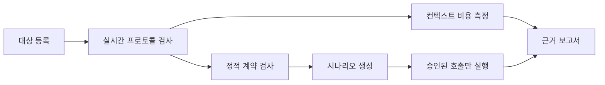

[English](README.md) | **한국어**

# MCP QA Lab

[](https://github.com/efficjump/mcp-qa-lab/actions/workflows/ci.yml)
[](https://www.python.org/)
[](LICENSE)

Model Context Protocol 서버를 근거 중심으로 품질 검사합니다. MCP QA Lab은 실제 클라이언트처럼 연결해 모델이 보는 계약 전체를 수집하고, 에이전트 사용성 위험과 컨텍스트 비용을 찾으며, 명시적으로 승인된 대상 호출만 실행합니다.

## 왜 필요한가요?

핸들러 단위 테스트를 모두 통과한 서버도 에이전트가 사용하기 어려울 수 있습니다. 도구 이름이 모호하거나, 입력 필드 설명이 없거나, 페이지네이션이 불완전하거나, 안전 의도가 표시되지 않을 수 있기 때문입니다. MCP QA Lab은 구현 코드와 분리해 공개 프로토콜 표면을 검사합니다.



## 주요 특징

- 도구, 프롬프트, 리소스, 리소스 템플릿을 페이지 끝까지 탐색합니다.
- 스키마 품질, 이름, 설명, 안전 어노테이션을 결정론적으로 검사합니다.
- 모델이 보는 계약 크기와 대략적인 컨텍스트 비용을 측정합니다.
- 호스트 모델 샘플링으로 작업 중심 테스트 여정을 제안합니다.
- 부작용 가능성이 있는 대상 도구 호출에 명시적 승인 경계를 둡니다.
- 환경 변수 값이 아니라 이름만 저장해 대상을 등록합니다.
- 재현 가능한 근거를 포함하고 민감 정보를 가린 Markdown 보고서를 만듭니다.
- stdio 및 Streamable HTTP 대상을 지원합니다.

## 설치

```bash
uv tool install "git+https://github.com/efficjump/mcp-qa-lab.git"
mcp-qa-lab --transport stdio
```

소스에서 개발하려면 다음 명령을 사용합니다.

```bash
git clone https://github.com/efficjump/mcp-qa-lab.git
cd mcp-qa-lab
uv sync --all-extras --locked
uv run mcp-qa-lab --transport stdio
```

## 일반 MCP 클라이언트 설정

```json
{
  "mcpServers": {
    "mcp-qa-lab": {
      "command": "mcp-qa-lab",
      "args": ["--transport", "stdio"]
    }
  }
}
```

클라이언트마다 설정 형식은 다르지만, 설치 후에는 위 명령과 인자에 로컬 저장소 경로가 필요하지 않습니다.

## 도구 흐름

| 도구 | 목적 |
| --- | --- |
| `register_target` | 민감 값을 포함하지 않는 stdio 또는 Streamable HTTP 대상 정의 저장 |
| `list_targets` | 등록한 대상 조회 |
| `inspect_target` | 실제 페이지네이션을 따라 MCP 계약 전체 수집 |
| `run_static_checks` | 결정론적 계약·사용성 문제 탐지 |
| `measure_context_cost` | 직렬화된 계약 크기와 대략적인 토큰 비용 측정 |
| `generate_scenarios` | 호스트 모델에 근거 중심 테스트 여정 제안 요청 |
| `run_target_tool` | 안전 승인을 거쳐 검토한 대상 도구 한 번 호출 |
| `build_report` | 민감 정보를 가린 Markdown QA 보고서 작성 |

## 기본 안전 정책

- `MCP_QA_ALLOW_REMOTE=1`이 아니면 원격 대상을 거부합니다.
- 설정한 경우 로컬 대상의 작업 디렉터리는 `MCP_QA_ALLOWED_ROOTS` 안에 있어야 합니다.
- 등록 정보는 상속할 환경 변수의 이름만 참조하며 값을 저장하지 않습니다.
- 검사와 정적 검사는 대상 도구를 호출하지 않습니다.
- `readOnlyHint: true`가 없는 도구는 명시적인 부작용 승인이 필요합니다.
- 보고서에서 자격 증명, 인증 헤더, 토큰, URL 사용자 정보를 가립니다.

프로세스 경계는 운영체제 샌드박스가 아닙니다. 신뢰할 수 없는 대상은 격리된 환경에서 실행하세요.

## Streamable HTTP

```bash
mcp-qa-lab --transport streamable-http --host 127.0.0.1 --port 8765
```

기본 엔드포인트는 `http://127.0.0.1:8765/mcp`입니다. 별도 인증과 네트워크 경계가 없다면 루프백 밖으로 노출하지 마세요.

## 개발

```bash
uv sync --all-extras --locked
uv run ruff format --check .
uv run ruff check .
uv run mypy src
uv run pytest --cov --cov-report=term-missing
uv build
```

테스트 커버리지 기준은 85%입니다. 자세한 내용은 [아키텍처](docs/architecture.md), [보안 정책](SECURITY.md), [기여 안내](CONTRIBUTING.md)를 참고하세요.

## 라이선스

[MIT](LICENSE)
