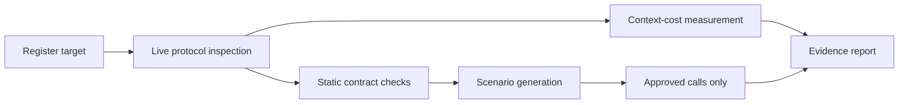

**English** | [한국어](README.ko.md)

# MCP QA Lab

[](https://github.com/efficjump/mcp-qa-lab/actions/workflows/ci.yml)
[](https://www.python.org/)
[](LICENSE)

Evidence-driven quality testing for Model Context Protocol servers. MCP QA Lab connects as a real
client, captures the complete model-facing contract, finds agent-usability risks, measures context
cost, and runs only explicitly approved target calls.

## Why use it?

A server can have perfect handler-level tests and still be difficult for an agent to use. Tool names
may be ambiguous, input fields may be undocumented, pagination may be incomplete, and safety intent
may be missing. MCP QA Lab tests that public protocol surface separately from implementation code.



## Highlights

- Complete paginated discovery of tools, prompts, resources, and resource templates
- Deterministic checks for schema quality, naming, descriptions, and safety annotations
- Model-facing contract size and approximate context-cost measurement
- Host-model sampling for task-oriented scenario proposals
- Explicit approval boundary for target tool calls with possible side effects
- Secret-free target registration using environment variable names, never values
- Redacted Markdown reports with reproducible evidence
- Stdio and Streamable HTTP target support

## Install

Install directly from the public repository:

```bash
uv tool install "git+https://github.com/efficjump/mcp-qa-lab.git"
mcp-qa-lab --transport stdio
```

For source development:

```bash
git clone https://github.com/efficjump/mcp-qa-lab.git
cd mcp-qa-lab
uv sync --all-extras --locked
uv run mcp-qa-lab --transport stdio
```

## Generic MCP client configuration

```json
{
  "mcpServers": {
    "mcp-qa-lab": {
      "command": "mcp-qa-lab",
      "args": ["--transport", "stdio"]
    }
  }
}
```

Client configuration formats vary; the command and arguments above do not require a local repository
path after tool installation.

## Tool workflow

| Tool | Purpose |
| --- | --- |
| `register_target` | Persist a secret-free stdio or Streamable HTTP target definition |
| `list_targets` | List registered targets |
| `inspect_target` | Capture the live, paginated MCP contract |
| `run_static_checks` | Find deterministic contract and usability issues |
| `measure_context_cost` | Measure serialized contract size and approximate token cost |
| `generate_scenarios` | Ask the host model for evidence-oriented test journeys |
| `run_target_tool` | Invoke one reviewed target tool with safety approval |
| `build_report` | Write a redacted Markdown QA report |

## Safety defaults

- Remote targets are denied unless `MCP_QA_ALLOW_REMOTE=1`.
- Local target working directories must stay inside `MCP_QA_ALLOWED_ROOTS` when configured.
- Registrations reference inherited environment variable names; values are never persisted.
- Inspection and static checks never invoke target tools.
- Tools without `readOnlyHint: true` require explicit side-effect approval.
- Reports redact credentials, authorization headers, tokens, and URL user information.

The process boundary is not an operating-system sandbox. Run untrusted targets in an isolated
environment.

## Streamable HTTP

```bash
mcp-qa-lab --transport streamable-http --host 127.0.0.1 --port 8765
```

The default endpoint is `http://127.0.0.1:8765/mcp`. Keep the listener on loopback unless a separate
authentication and network boundary is in place.

## Development

```bash
uv sync --all-extras --locked
uv run ruff format --check .
uv run ruff check .
uv run mypy src
uv run pytest --cov --cov-report=term-missing
uv build
```

The coverage gate is 85%. See [architecture](docs/architecture.md),
[security policy](SECURITY.md), and [contribution guide](CONTRIBUTING.md).

## License

[MIT](LICENSE)
